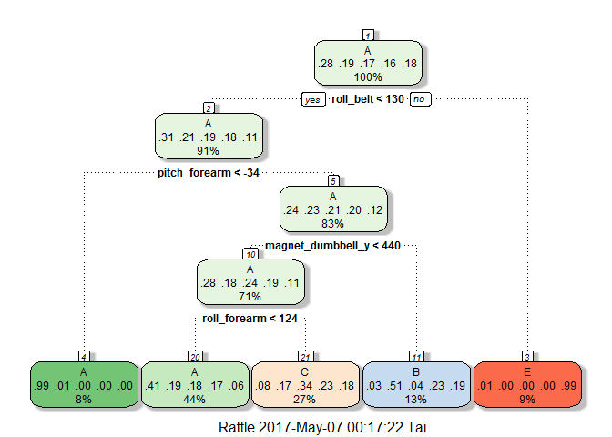

# Machine Learning Course Project
Tai Chin Chuen  
May 6, 2017  


#Background

Using devices such as Jawbone Up, Nike FuelBand, and Fitbit it is now possible to collect a large amount of data about personal activity relatively inexpensively. These type of devices are part of the quantified self movement - a group of enthusiasts who take measurements about themselves regularly to improve their health, to find patterns in their behavior, or because they are tech geeks. One thing that people regularly do is quantify how much of a particular activity they do, but they rarely quantify how well they do it. 

In this project, we will use data from accelerometers on the belt, forearm, arm, and dumbell of 6 participants. Six young health participants were asked to perform one set of 10 repetitions of the Unilateral Dumbbell Biceps Curl in five different fashions: exactly according to the specification (Class A), throwing the elbows to the front (Class B), lifting the dumbbell only halfway (Class C), lowering the dumbbell only halfway (Class D) and throwing the hips to the front (Class E).  The goal of this project is to predict the manner in which they did the exercise. 

More information is available from the website here: http://groupware.les.inf.puc-rio.br/har (see the section on the Weight Lifting Exercise Dataset).

#Data Processing

First, the required R packages are loaded and then the training and testing data sets are downloaded from the given URLs.


```r
library(caret)
```

```
## Loading required package: lattice
```

```
## Loading required package: ggplot2
```

```r
library(rpart)
library(rpart.plot)
library(rattle)
```

```
## Rattle: A free graphical interface for data mining with R.
## XXXX 4.1.0 Copyright (c) 2006-2015 Togaware Pty Ltd.
## Type 'rattle()' to shake, rattle, and roll your data.
```

```r
library(randomForest)
```

```
## randomForest 4.6-12
```

```
## Type rfNews() to see new features/changes/bug fixes.
```

```
## 
## Attaching package: 'randomForest'
```

```
## The following object is masked from 'package:ggplot2':
## 
##     margin
```


```r
#Download the data
if(!file.exists("pml-training.csv")){download.file("https://d396qusza40orc.cloudfront.net/predmachlearn/pml-training.csv", destfile = "pml-training.csv")}

if(!file.exists("pml-testing.csv")){download.file("https://d396qusza40orc.cloudfront.net/predmachlearn/pml-testing.csv", destfile = "pml-testing.csv")}

#Read the training data and replace empty values by NA
training <- read.csv("pml-training.csv", sep=",", header=TRUE, na.strings = c("NA","",'#DIV/0!'))
testing <- read.csv("pml-testing.csv", sep=",", header=TRUE, na.strings = c("NA","",'#DIV/0!'))
dim(training)
```

```
## [1] 19622   160
```

```r
dim(testing)
```

```
## [1]  20 160
```

The training dataset has 19622 observations and 160 variables, while the testing data set contains 20 observations and the same variables as the training set.  The goal is to predict the outcome of the variable `classe` in the data set.

#Data Cleaning

The columns (predictors) of the training set that contain any missing values or near zero variance will be eliminated from our analysis.  The first six predictors have also been removed since these variables have little predicting power for the outcome variable.  The same measure that applied on training set should also be applied on testing set.


```r
nzv <- nearZeroVar(training)
training <- training[ , -nzv]
testing <- testing[ , -nzv]

training <- training[, colSums(is.na(training)) == 0]

training <- training[, -c(1:6)]

trainvar <- colnames(training[ , -53])
trainvar <- c(trainvar, "problem_id")

testing <- testing[, colnames(testing) %in% trainvar]

dim(training)
```

```
## [1] 19622    53
```

```r
dim(testing)
```

```
## [1] 20 53
```

The cleaned data sets `training` and `testing` both have 53 columns with the same first 52 variables and the last variable `classe` and  `problem_id` individually. `training` has 19622 rows while `testing` has 20 rows.

#Data Spliting

In order to get out-of-sample errors, the cleaned training set is split into a training set (train, 70%) for prediction and a validation set (valid 30%) to compute the out-of-sample errors.


```r
set.seed(91) 
inTrain <- createDataPartition(training$classe, p = 0.7, list = FALSE)
train <- training[inTrain, ]
valid <- training[-inTrain, ]
dim(train)
```

```
## [1] 13737    53
```

```r
dim(valid)
```

```
## [1] 5885   53
```

#Data Analysis

We use Decision Tree Learning and Random Forests to predict the outcome `classe`.

###(a) Decision Tree Learning

In k-fold cross validation, we will consider 5-fold cross validation (default setting is 10) when implementing the algorithm.  Note: No variable has been transformed here since this is a non-linear model. 


```r
control <- trainControl(method = "cv", number = 5)
fit_rpart <- train(classe ~ ., data = train, method = "rpart", trControl = control)
print(fit_rpart, digits = 4)
```

```
## CART 
## 
## 13737 samples
##    52 predictor
##     5 classes: 'A', 'B', 'C', 'D', 'E' 
## 
## No pre-processing
## Resampling: Cross-Validated (5 fold) 
## Summary of sample sizes: 10989, 10990, 10990, 10989, 10990 
## Resampling results across tuning parameters:
## 
##   cp       Accuracy  Kappa  
##   0.03519  0.5151    0.36656
##   0.06025  0.4430    0.25293
##   0.11738  0.3328    0.07386
## 
## Accuracy was used to select the optimal model using  the largest value.
## The final value used for the model was cp = 0.03519.
```

```r
fit_rpart$finalModel
```

```
## n= 13737 
## 
## node), split, n, loss, yval, (yprob)
##       * denotes terminal node
## 
##  1) root 13737 9831 A (0.28 0.19 0.17 0.16 0.18)  
##    2) roll_belt< 130.5 12563 8667 A (0.31 0.21 0.19 0.18 0.11)  
##      4) pitch_forearm< -33.95 1113    7 A (0.99 0.0063 0 0 0) *
##      5) pitch_forearm>=-33.95 11450 8660 A (0.24 0.23 0.21 0.2 0.12)  
##       10) magnet_dumbbell_y< 439.5 9690 6959 A (0.28 0.18 0.24 0.19 0.11)  
##         20) roll_forearm< 124.5 6032 3587 A (0.41 0.19 0.18 0.17 0.058) *
##         21) roll_forearm>=124.5 3658 2427 C (0.078 0.17 0.34 0.23 0.18) *
##       11) magnet_dumbbell_y>=439.5 1760  869 B (0.034 0.51 0.041 0.23 0.19) *
##    3) roll_belt>=130.5 1174   10 E (0.0085 0 0 0 0.99) *
```

```r
#plot the decision tree
fancyRpartPlot(fit_rpart$finalModel)
```

<!-- -->

```r
#predict outcomes using validation set for Decision Tree Method
predict_rpart <- predict(fit_rpart, valid)

#Show prediction result for Decision Tree Method
(conf_rpart <- confusionMatrix(valid$classe, predict_rpart))
```

```
## Confusion Matrix and Statistics
## 
##           Reference
## Prediction    A    B    C    D    E
##          A 1533   22  115    0    4
##          B  454  395  290    0    0
##          C  501   35  490    0    0
##          D  440  170  354    0    0
##          E  176  147  292    0  467
## 
## Overall Statistics
##                                           
##                Accuracy : 0.4902          
##                  95% CI : (0.4774, 0.5031)
##     No Information Rate : 0.5274          
##     P-Value [Acc > NIR] : 1               
##                                           
##                   Kappa : 0.333           
##  Mcnemar's Test P-Value : NA              
## 
## Statistics by Class:
## 
##                      Class: A Class: B Class: C Class: D Class: E
## Sensitivity            0.4939  0.51365  0.31798       NA  0.99151
## Specificity            0.9493  0.85457  0.87661   0.8362  0.88641
## Pos Pred Value         0.9158  0.34680  0.47758       NA  0.43161
## Neg Pred Value         0.6269  0.92120  0.78370       NA  0.99917
## Prevalence             0.5274  0.13067  0.26185   0.0000  0.08003
## Detection Rate         0.2605  0.06712  0.08326   0.0000  0.07935
## Detection Prevalence   0.2845  0.19354  0.17434   0.1638  0.18386
## Balanced Accuracy      0.7216  0.68411  0.59729       NA  0.93896
```

```r
#show the accuracy for Decision Tree Method
(accuracy_rpart <- conf_rpart$overall[1])
```

```
##  Accuracy 
## 0.4902294
```

```r
#show the out of sample error for Decision Tree Method
(out_of_sample_error_rpart <- 1 - as.numeric(accuracy_rpart))
```

```
## [1] 0.5097706
```

From the confusion matrix, the accuracy rate is 0.5, and so the out-of-sample error rate is 0.5.  Thus, the result shows that classification tree method does not predict the outcome `classe` very well.

###(b) Random forests
Since classification tree method does not perform well, the random forest method is adopted to predict the outcome `classe`.


```r
fit_rf <- train(classe ~ ., data = train, method = "rf", 
                trControl = control)
print(fit_rf, digits = 4)
```

```
## Random Forest 
## 
## 13737 samples
##    52 predictor
##     5 classes: 'A', 'B', 'C', 'D', 'E' 
## 
## No pre-processing
## Resampling: Cross-Validated (5 fold) 
## Summary of sample sizes: 10988, 10990, 10989, 10990, 10991 
## Resampling results across tuning parameters:
## 
##   mtry  Accuracy  Kappa 
##    2    0.9916    0.9893
##   27    0.9897    0.9869
##   52    0.9808    0.9757
## 
## Accuracy was used to select the optimal model using  the largest value.
## The final value used for the model was mtry = 2.
```

```r
fit_rf$finalModel
```

```
## 
## Call:
##  randomForest(x = x, y = y, mtry = param$mtry) 
##                Type of random forest: classification
##                      Number of trees: 500
## No. of variables tried at each split: 2
## 
##         OOB estimate of  error rate: 0.68%
## Confusion matrix:
##      A    B    C    D    E  class.error
## A 3904    2    0    0    0 0.0005120328
## B   10 2642    6    0    0 0.0060195636
## C    0   18 2375    3    0 0.0087646077
## D    0    0   44 2206    2 0.0204262877
## E    0    0    4    5 2516 0.0035643564
```

```r
#predict outcomes using validation set for Random Forest Method
predict_rf <- predict(fit_rf, valid)

#Show prediction result for Random Forest Method
(conf_rf <- confusionMatrix(valid$classe, predict_rf))
```

```
## Confusion Matrix and Statistics
## 
##           Reference
## Prediction    A    B    C    D    E
##          A 1671    3    0    0    0
##          B    8 1130    1    0    0
##          C    0    7 1017    2    0
##          D    0    0   17  946    1
##          E    0    0    2    1 1079
## 
## Overall Statistics
##                                           
##                Accuracy : 0.9929          
##                  95% CI : (0.9904, 0.9949)
##     No Information Rate : 0.2853          
##     P-Value [Acc > NIR] : < 2.2e-16       
##                                           
##                   Kappa : 0.991           
##  Mcnemar's Test P-Value : NA              
## 
## Statistics by Class:
## 
##                      Class: A Class: B Class: C Class: D Class: E
## Sensitivity            0.9952   0.9912   0.9807   0.9968   0.9991
## Specificity            0.9993   0.9981   0.9981   0.9964   0.9994
## Pos Pred Value         0.9982   0.9921   0.9912   0.9813   0.9972
## Neg Pred Value         0.9981   0.9979   0.9959   0.9994   0.9998
## Prevalence             0.2853   0.1937   0.1762   0.1613   0.1835
## Detection Rate         0.2839   0.1920   0.1728   0.1607   0.1833
## Detection Prevalence   0.2845   0.1935   0.1743   0.1638   0.1839
## Balanced Accuracy      0.9973   0.9947   0.9894   0.9966   0.9992
```

```r
#show accuracy for Random Forest Method
(accuracy_rf <- conf_rf$overall[1])
```

```
##  Accuracy 
## 0.9928632
```

```r
#show out of sample error for Random Forest Method
(out_of_sample_error_rf <- 1 - as.numeric(accuracy_rf))
```

```
## [1] 0.007136788
```

For this dataset, the accuracy of random forest method is far better than the classification tree method. The accuracy rate is 0.993, and so the out-of-sample error rate is 0.007.  This may be due to the fact that many predictors are highly correlated. Since random forest method splits and bootstraps variables, and leads to high accuracy, although this algorithm is sometimes difficult to interpret and computationally inefficient. This can be seen that it does take longer to run even though random forest is more accurate.

#Prediction on Testing Set

Since random forest method is most accurate method, we now use random forest method to predict the outcome variable `classe` for the testing set.


```r
(predict(fit_rf, testing))
```

```
##  [1] B A B A A E D B A A B C B A E E A B B B
## Levels: A B C D E
```

The random forest method is applied to the 20 test cases available in the test data and made predictions in appropriate format to the Course Project Prediction Quiz.
